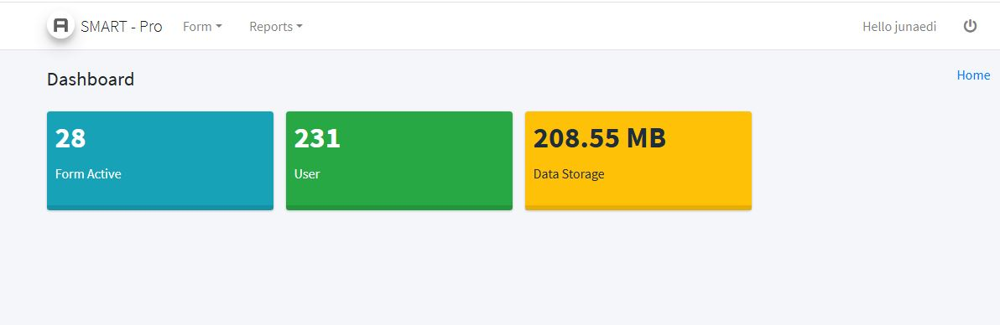
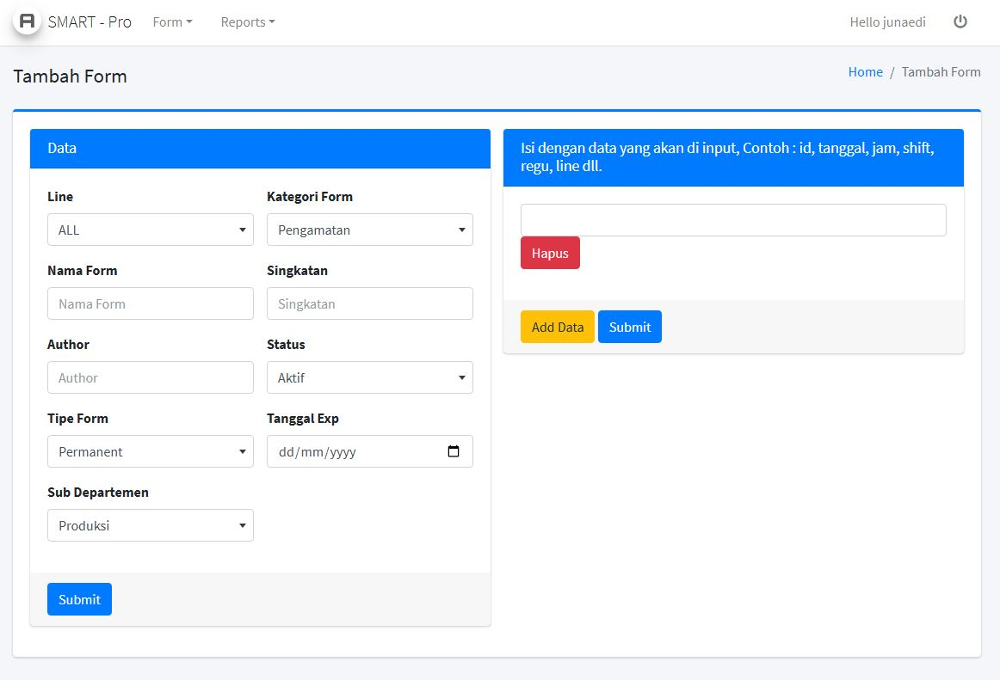
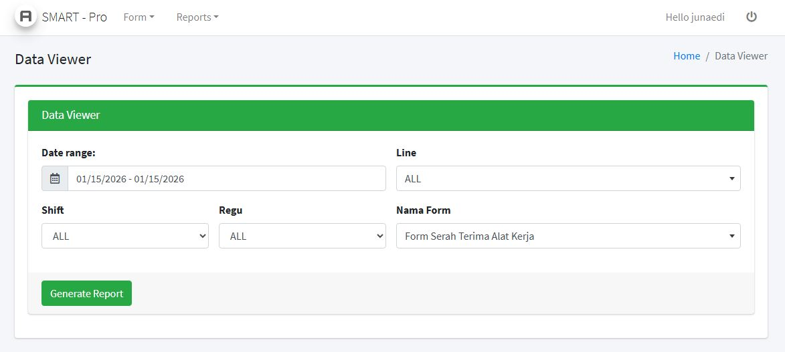

  <h2 align="center">SmartPro – Dynamic Form Generator</h2>
  

    No-code web application for creating dynamic forms using JSON storage
  

  
  
  
  

---

## 🚀 Overview

**SmartPro** is a lightweight web application that allows users to create, manage, and render dynamic forms **without coding**.  
Form schemas and submissions are stored in **JSON**, while **PostgreSQL** is used for authentication.

---

## ✨ Features

- 🔐 User authentication (PostgreSQL)
- 🧩 Dynamic form builder
- ➕ Add new forms without coding
- 💾 JSON-based data storage
- ⚡ Lightweight & fast
- 📱 Responsive UI (Bootstrap)

---

## 🛠️ Tech Stack

| Layer | Technology |
|-----|-----------|
| Frontend | HTML, CSS, JavaScript, Bootstrap |
| Backend | PHP |
| Authentication | PostgreSQL |
| Form Storage | JSON |

---

## 📁 Folder Structure

assets/ -> CSS, JS, Bootstrap
page/ -> Application pages
db/ -> JSON & data handling
uploads/ -> File uploads

---

## 🔄 Application Flow

1. User login & authentication
2. Authorized user accesses form builder
3. Form schema saved as JSON
4. Form rendered dynamically
5. Submission stored in JSON format

---

## 📸 Screenshots

> Add screenshots in `/docs` folder

docs/
├── login.png
├── dashboard.png
└── form-builder.png

---

## 🔒 Security Notes

- Database credentials are excluded from repository
- `.gitignore` is used to protect sensitive files

---

## 📄 License

MIT License

### Login Page

### Dashboard

### Form Builder

### Report

